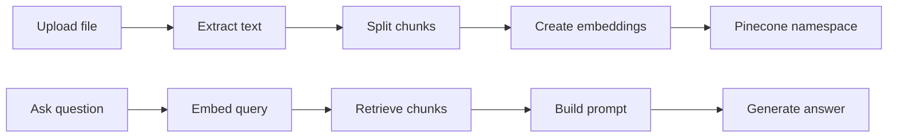

# Personal RAG AI Bot Builder

A lightweight Flask app for building personal AI assistants that answer from uploaded documents.

Users can create a bot profile, choose AI providers, upload PDF/DOCX/TXT files, and chat against a private Pinecone-backed knowledge base.

Live app:

```text
https://personal-ai-bot-builder-sigma.vercel.app
```

## Screenshots

| Login | Dashboard |
| --- | --- |
|  |  |

| Providers | Upload |
| --- | --- |
|  |  |

| Chat | Personality |
| --- | --- |
|  |  |

## Stack

| Layer | Tech |
| --- | --- |
| App | Flask application factory |
| Controllers | Route modules in `controllers/` |
| Views | Jinja templates in `templates/` |
| Services | Business logic in `services/` |
| UI | HTML, CSS, vanilla JavaScript |
| Auth | Flask sessions, user/admin guards |
| Data | MongoDB Atlas in production, SQLite locally |
| Vector DB | Pinecone namespaces per user |
| Documents | PyPDF2, python-docx, TXT parser |
| Chunking | `langchain-text-splitters` |
| Chat | Groq, OpenRouter, Gemini, Hugging Face, Ollama |
| Embeddings | Gemini, Hugging Face, Pinecone, Ollama, sentence-transformers |
| Deploy | Vercel Python Functions |

## Project Structure

```text
app.py                 # Flask app factory and bootstrap
config.py              # Runtime config and environment defaults
controllers/           # Route handlers grouped by workflow
database/              # SQLite schema plus MongoDB/SQLite adapter layer
services/              # Auth, RAG, provider, document, and vector logic
templates/             # Jinja views
static/                # Cached CSS and JavaScript
docs/screenshots/      # README screenshots
uploads/               # Local upload folder; ignored except .gitkeep
```

The current structure follows a practical MVC split:

- **Controllers:** request/response flow only
- **Views:** Jinja templates and static assets
- **Model/Data:** `database/` persistence adapter plus service-layer domain operations

## Workflow



## Performance Notes

- Static CSS/JS is served with immutable cache headers.
- UI uses system fonts, so no remote font request is needed.
- Page-load animation was removed to avoid first-paint work and screenshot fade.
- Provider dropdown logic lives in cached `static/app.js`.
- Chat defaults are tuned for Vercel free-tier response time: shorter HTTP read timeout, smaller answer token budget, and fewer retrieved chunks.
- Local-only providers fail fast on Vercel instead of hanging.
- SQLite fallback creates its schema on connection, so local/dev fallback recovers if the generated DB file is removed.

## Local Setup

From the project folder:

```bash
cd /home/asura/Downloads/botty/personal-ai-bot-builder
```

Create and install dependencies:

```bash
python -m venv .venv
source .venv/bin/activate
pip install -r requirements.txt
cp .env.example .env
```

Run locally:

```bash
flask --app app run --host 127.0.0.1 --port 5000
```

Open:

```text
http://127.0.0.1:5000
```

Default local admin credentials come from environment variables:

```bash
ADMIN_EMAIL=admin@example.com
ADMIN_PASSWORD=admin123
```

## Required Environment

```bash
FLASK_SECRET_KEY=replace-me
MONGODB_URI=mongodb+srv://...
MONGODB_DB_NAME=personal-ai-bot-builder

GROQ_API_KEY=...
GEMINI_API_KEY=...
PINECONE_API_KEY=...
PINECONE_INDEX_NAME=personal-ai-bot

DEFAULT_CHAT_PROVIDER=groq
DEFAULT_CHAT_MODEL=llama-3.3-70b-versatile
DEFAULT_EMBEDDING_PROVIDER=gemini
DEFAULT_EMBEDDING_MODEL=gemini-embedding-001
```

For first MongoDB setup:

```bash
MONGO_AUTO_CREATE_INDEXES=1
```

After indexes exist on production:

```bash
MONGO_AUTO_CREATE_INDEXES=0
```

## Deploy

```bash
npx vercel deploy --prod
```

The project includes:

- `vercel.json` for Python function routing and static cache headers
- `.vercelignore` to keep local env files, virtualenvs, SQLite DB files, and uploads out of deployments
- `.gitignore` to keep generated runtime files out of Git

## Health Check

```bash
curl /healthz
curl /healthz?deep=1
```

`/healthz` is shallow and fast. `?deep=1` checks remote dependencies.

If MongoDB is unavailable, the app falls back to SQLite so the UI can still load. For durable production data, fix the MongoDB connection and verify `/healthz?deep=1`.

## Limits

- 2 uploaded documents per account
- 5 MB max per file
- 5 user chat messages per account
- Uploaded filenames are sanitized
- Pinecone operations are scoped to `user_{id}` namespaces

## Notes For Maintenance

- Keep route handlers in `controllers/`.
- Keep external API and RAG behavior in `services/`.
- Keep database query compatibility in `database/db.py`.
- Do not commit `.env`, `.env.local`, `database/*.db`, virtualenv folders, or uploaded files.
