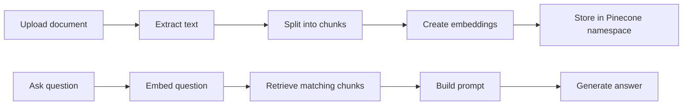

# Personal RAG AI Bot Builder

A lightweight Flask app for creating personal AI assistants that answer from uploaded documents.

Users can:

- create a bot profile and personality prompt
- upload PDF, DOCX, or TXT files
- choose separate chat and embedding providers
- ask questions against their private knowledge base
- manage providers, documents, and chat history from a simple sketch-style UI

## Screenshots

| Login | Dashboard |
| --- | --- |
|  |  |

| Providers | Upload | Chat |
| --- | --- | --- |
|  |  |  |

## Stack

| Layer | Tech |
| --- | --- |
| Web app | Flask, Jinja templates |
| UI | HTML, CSS, vanilla JavaScript |
| Styling | Sketchbook theme, handwritten fonts, cached static CSS |
| Auth | Flask sessions, user/admin route guards |
| Data | MongoDB Atlas in production, SQLite locally |
| Vector DB | Pinecone namespaces per user |
| Chunking | `langchain-text-splitters` |
| Documents | PyPDF2, python-docx, plain text parser |
| Chat providers | Groq, OpenRouter, Gemini, Hugging Face, Ollama |
| Embeddings | Gemini, Hugging Face, Pinecone, Ollama, sentence-transformers |
| Deploy | Vercel Python Functions |

## Workflow



## Key Ideas

- Chat and embedding providers are separate, so generation and retrieval can be tuned independently.
- Pinecone data is isolated by namespace using `user_{id}`.
- Static assets are cached aggressively for faster Vercel loads.
- Local-only providers fail fast on Vercel instead of hanging.
- MongoDB is used for persistent production state; SQLite is only the local fallback.

## Local Setup

```bash
python -m venv .venv
source .venv/bin/activate
pip install -r requirements.txt
cp .env.example .env
python app.py
```

Open:

```text
http://127.0.0.1:5000
```

## Required Environment

Minimum production variables:

```bash
FLASK_SECRET_KEY=replace-me
MONGODB_URI=mongodb+srv://...
MONGODB_DB_NAME=personal-ai-bot-builder

GROQ_API_KEY=...
GEMINI_API_KEY=...
PINECONE_API_KEY=...
PINECONE_INDEX_NAME=personal-ai-bot

DEFAULT_CHAT_PROVIDER=groq
DEFAULT_CHAT_MODEL=llama-3.3-70b-versatile
DEFAULT_EMBEDDING_PROVIDER=gemini
DEFAULT_EMBEDDING_MODEL=gemini-embedding-001
```

For first-time MongoDB setup, temporarily enable index creation:

```bash
MONGO_AUTO_CREATE_INDEXES=1
```

After indexes exist, keep it disabled on Vercel:

```bash
MONGO_AUTO_CREATE_INDEXES=0
```

## Deploy

```bash
npx vercel --prod
```

The app includes `vercel.json` for Python function deployment and static asset cache headers.

## Health Check

```bash
curl /healthz
curl /healthz?deep=1
```

`/healthz` is shallow and fast. `?deep=1` checks remote dependencies.

## Security Notes

- Protected queries are scoped by authenticated `user_id`.
- Admin routes require admin role.
- Uploaded filenames are sanitized.
- API keys are stored server-side and masked in admin views.
- Pinecone operations are scoped to per-user namespaces.
