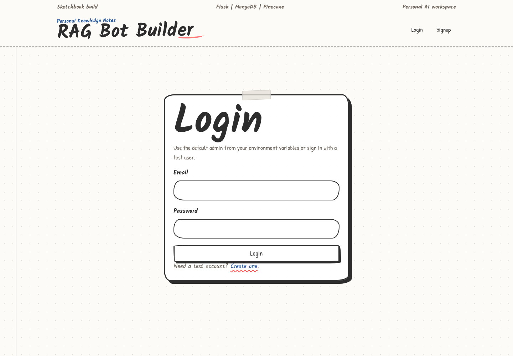
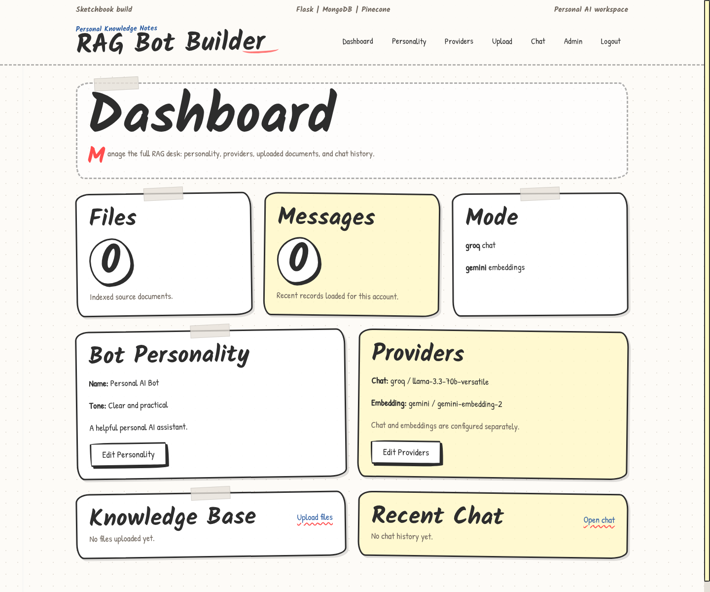
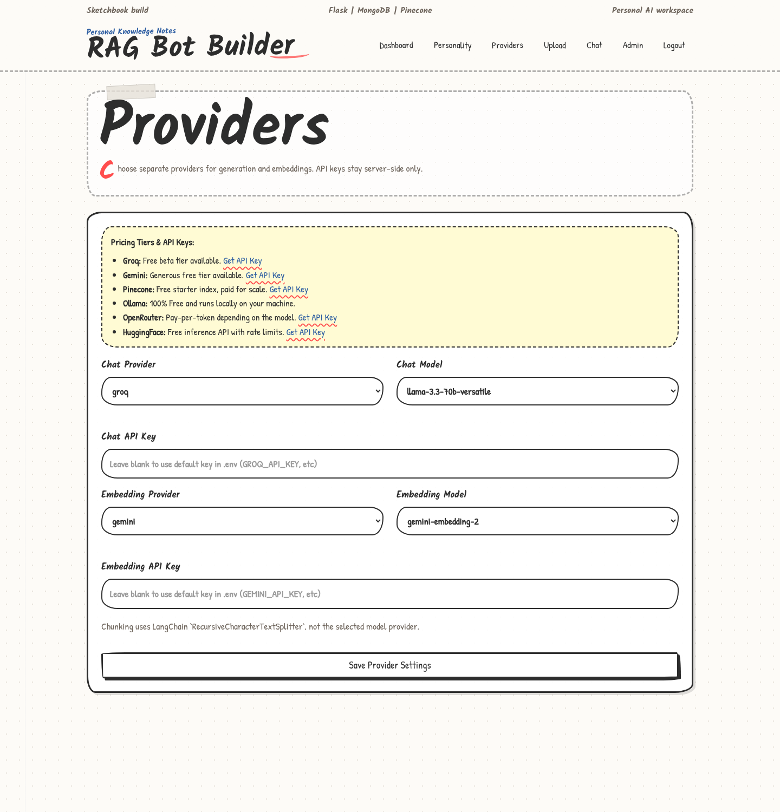
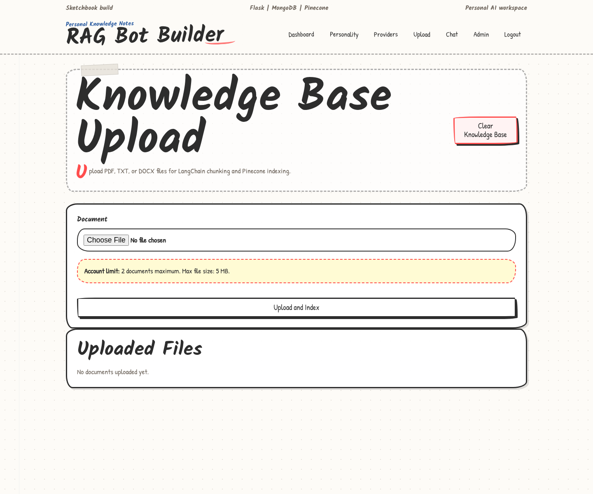
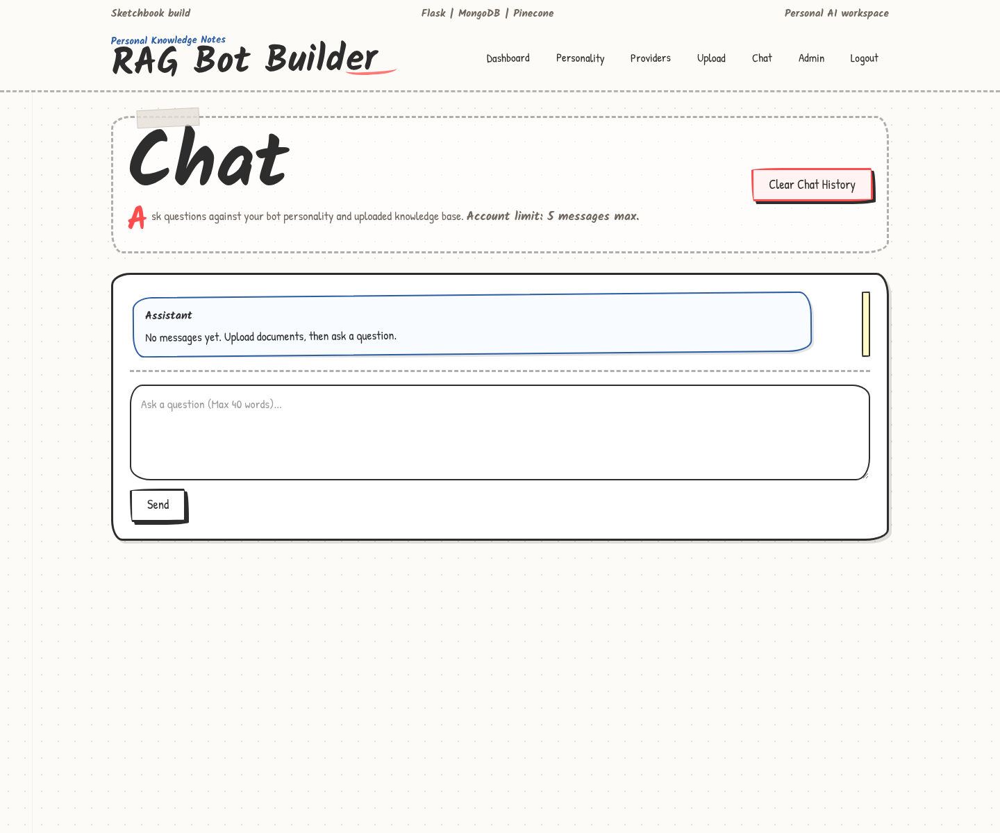
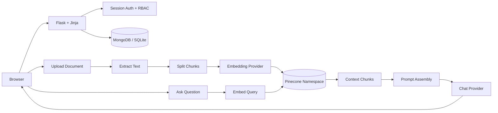
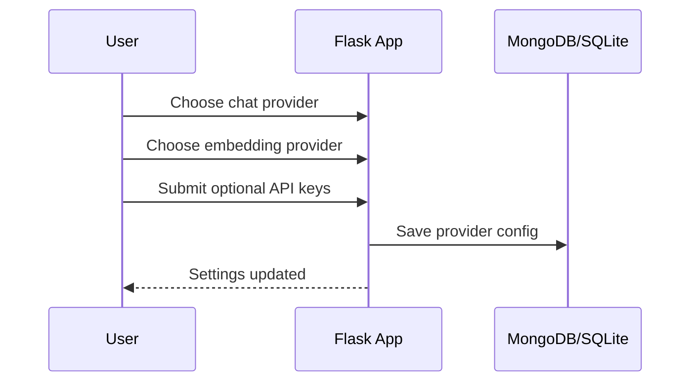
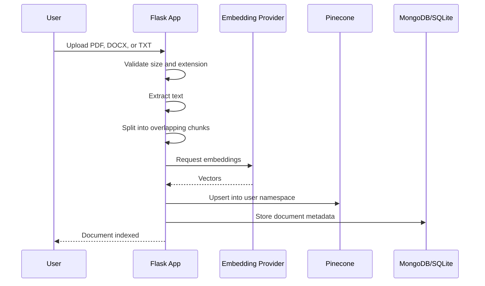
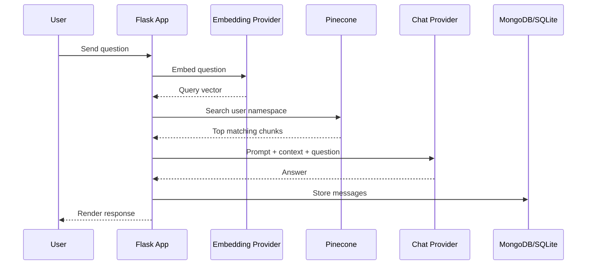

# Personal RAG AI Bot Builder

> A lightweight Flask application for building personal AI assistants over private documents.

The app lets users sketch out an assistant profile, upload a small knowledge base, choose separate chat and embedding providers, and ask grounded questions through a Retrieval-Augmented Generation pipeline. It is designed for Vercel-hosted Python functions, MongoDB persistence, and Pinecone vector retrieval without adding a heavy frontend build stack.

## Start Here

| I want to... | Go to |
| --- | --- |
| Understand the system shape | [Architecture](#architecture) |
| Follow the RAG flow | [How It Works](#how-it-works) |
| Configure providers | [Provider Setup](#provider-setup) |
| Run locally | [Local Development](#local-development) |
| Deploy on Vercel | [Deployment](#deployment) |
| Review security boundaries | [Security Notes](#security-notes) |

## Screenshots

The current interface uses the same lightweight Flask/Jinja pages in development and production. These captures show the main workflow from sign-in to retrieval chat.

| Step | Screen |
| --- | --- |
| Sign in |  |
| Review workspace |  |
| Configure providers |  |
| Upload documents |  |
| Ask questions |  |

## Interface Style

The UI uses a sketchbook-inspired system:

- warm paper background with subtle dot texture
- handwritten typography via `Kalam` and `Patrick Hand`
- wobbly cards, inputs, and buttons instead of rigid rectangles
- hard offset shadows instead of blurred shadows
- sticky-note/tape accents for lightweight hierarchy
- cached static CSS and vanilla JavaScript only

This keeps the interface approachable while preserving the small server-rendered footprint.

## System Capabilities

| Area | Implementation |
| --- | --- |
| Authentication | Flask sessions with user/admin route protection |
| Bot profile | Per-user assistant name, tone, description, and system prompt |
| Uploads | PDF, DOCX, and TXT extraction with strict payload limits |
| Chunking | `langchain-text-splitters` `RecursiveCharacterTextSplitter` |
| Embeddings | Gemini, Hugging Face, Pinecone-hosted embeddings, Ollama, sentence-transformers |
| Vector store | Pinecone namespaces scoped as `user_{id}` |
| Chat | Groq, OpenRouter, Gemini, Hugging Face, Ollama |
| Persistence | MongoDB Atlas in production, SQLite for local development |
| Frontend | Jinja templates, one cached CSS file, vanilla JavaScript |

## Architecture



<details>
<summary><strong>Why Flask + Jinja?</strong></summary>

The application does not need client-side routing or a large component runtime. Server-rendered pages keep first load simple, reduce deployment payload, and leave the complexity budget for the RAG pipeline, provider abstraction, and persistence layer.

</details>

<details>
<summary><strong>Why separate chat and embedding providers?</strong></summary>

Generation and embeddings have different cost, latency, and quality profiles. Keeping them separate allows combinations such as Groq for fast chat and Gemini or Pinecone for embeddings without changing the retrieval code.

</details>

## How It Works

### 1. Provider Setup



Provider keys are stored server-side and are never rendered back to the browser.

### 2. Document Upload



### 3. Grounded Chat



## Vercel Runtime Strategy

| Constraint | Handling |
| --- | --- |
| Cold starts | Small Flask/Jinja app, no frontend build pipeline, no full LangChain package |
| Static delivery | `/static/*` uses immutable cache headers |
| Provider latency | External calls use bounded connect/read timeouts |
| Local providers | Ollama and local sentence-transformers fail fast on Vercel |
| MongoDB startup | Short connection timeouts and opt-in index creation |
| Pinecone latency | Warm functions cache Pinecone client/index handles |
| Upload budget | Default 5 MB upload limit and 2-document account limit |
| Chat budget | 5 user-message account limit and bounded generation tokens |

Health check:

```bash
curl /healthz
```

Remote dependency check:

```bash
curl /healthz?deep=1
```

## Environment Variables

Copy the template:

```bash
cp .env.example .env
```

Minimum production values:

```bash
FLASK_SECRET_KEY=replace-me
MONGODB_URI=mongodb+srv://...
MONGODB_DB_NAME=personal-ai-bot-builder

GROQ_API_KEY=...
GEMINI_API_KEY=...
PINECONE_API_KEY=...
PINECONE_INDEX_NAME=personal-ai-bot

DEFAULT_CHAT_PROVIDER=groq
DEFAULT_CHAT_MODEL=llama-3.3-70b-versatile
DEFAULT_EMBEDDING_PROVIDER=gemini
DEFAULT_EMBEDDING_MODEL=gemini-embedding-001
```

For a new MongoDB database, temporarily enable index creation:

```bash
MONGO_AUTO_CREATE_INDEXES=1
```

After indexes exist, keep it disabled on Vercel:

```bash
MONGO_AUTO_CREATE_INDEXES=0
```

## Local Development

```bash
python -m venv .venv
source .venv/bin/activate
pip install -r requirements.txt
python app.py
```

Open:

```text
http://127.0.0.1:5000
```

Without `MONGODB_URI`, the app uses SQLite at `database/app.db`.

Local Ollama example:

```bash
DEFAULT_CHAT_PROVIDER=ollama
DEFAULT_CHAT_MODEL=llama3.2
DEFAULT_EMBEDDING_PROVIDER=ollama
DEFAULT_EMBEDDING_MODEL=nomic-embed-text
OLLAMA_BASE_URL=http://localhost:11434
```

## Deployment

1. Link the repository to Vercel.
2. Add production environment variables.
3. Use MongoDB Atlas for persistent state.
4. Use a Pinecone index dimension matching the selected embedding model.
5. Deploy from `main`.

The included `vercel.json` configures the Python function target, memory/duration budget, region, and immutable static asset headers.

## Security Notes

- Protected data queries are scoped by authenticated `user_id`.
- Admin routes require the admin role.
- Uploaded filenames are normalized with `secure_filename`.
- API keys are stored server-side and masked in admin views.
- Jinja escapes rendered user and document content.
- Pinecone operations are scoped to per-user namespaces.

## Production Hardening

- Encrypt stored provider API keys.
- Add CSRF protection to form posts.
- Move larger ingestion jobs to a queue if upload limits increase.
- Add request tracing around provider calls.
- Add streaming responses if chat latency becomes a UX issue.

## References

- Vercel pricing: https://vercel.com/pricing
- Vercel timeout guidance: https://examples.vercel.com/kb/guide/what-can-i-do-about-vercel-serverless-functions-timing-out
