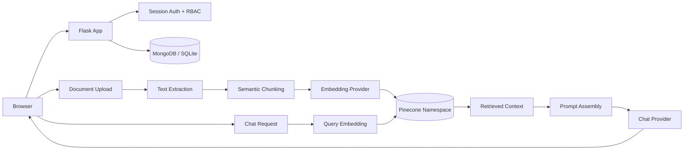
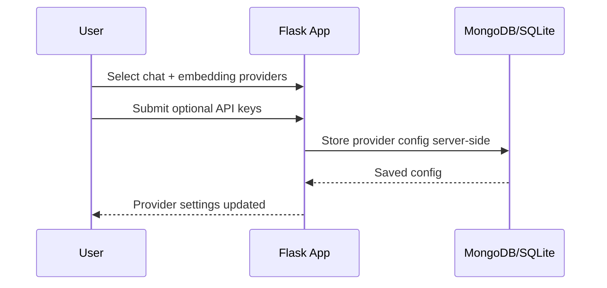
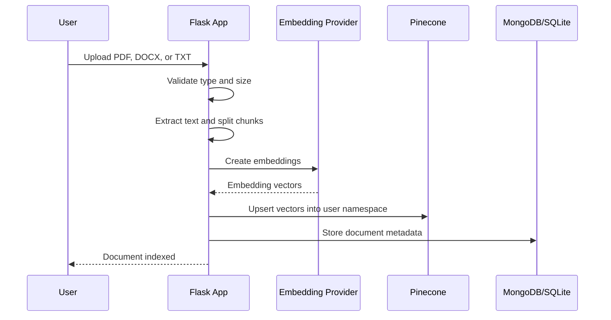
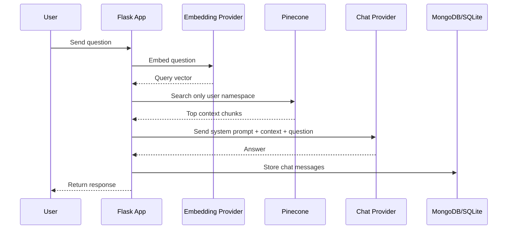

# Personal RAG AI Bot Builder

A production-oriented Flask application for building personal AI assistants over user-uploaded documents.

Users can create an assistant profile, upload a private knowledge base, configure separate chat and embedding providers, and ask grounded questions through a Retrieval-Augmented Generation pipeline. The application is designed for low-cost serverless hosting on Vercel while keeping persistent state in MongoDB and vectors in Pinecone.

## Quick Links

- [Architecture](#architecture)
- [Core Workflows](#core-workflows)
- [Vercel Runtime Strategy](#vercel-runtime-strategy)
- [Environment Variables](#environment-variables)
- [Local Development](#local-development)
- [Deployment](#deployment)
- [Security Notes](#security-notes)

## System Capabilities

| Area | Implementation |
| --- | --- |
| Authentication | Flask sessions with user/admin route protection |
| Bot configuration | Per-user assistant name, tone, description, and system prompt |
| Document ingestion | PDF, DOCX, and TXT extraction with strict upload limits |
| Chunking | `langchain-text-splitters` `RecursiveCharacterTextSplitter` |
| Embeddings | Gemini, Hugging Face, Pinecone-hosted embeddings, Ollama, sentence-transformers |
| Vector search | Pinecone namespaces scoped as `user_{id}` |
| Chat generation | Groq, OpenRouter, Gemini, Hugging Face, Ollama |
| Persistence | MongoDB Atlas in production, SQLite for local development |
| UI | Server-rendered Jinja, cached CSS, vanilla JavaScript |

## Architecture



## Core Workflows

### 1. Configure Providers



Chat and embeddings are intentionally separate. A user can choose Groq for fast generation and Gemini or Pinecone for embeddings without changing the core RAG code.

### 2. Upload and Index Documents



### 3. Ask a Grounded Question



## Vercel Runtime Strategy

The application is structured to avoid slow request paths on Vercel:

| Constraint | Current Handling |
| --- | --- |
| Cold starts | Small Flask/Jinja app, no frontend build pipeline, no full LangChain dependency |
| Static delivery | `/static/*` assets use immutable cache headers |
| External API latency | Requests use bounded connect/read timeouts |
| Local providers in production | Ollama and local sentence-transformers fail fast on Vercel |
| MongoDB startup cost | Short connection timeouts and opt-in index creation |
| Pinecone latency | Client/index handles are cached inside warm functions |
| Upload cost | 5 MB default payload limit and 2-document account limit |
| Chat cost | 5 user-message account limit and bounded generation tokens |

Health checks are intentionally shallow by default:

```bash
curl /healthz
```

Use the remote check only when diagnosing infrastructure:

```bash
curl /healthz?deep=1
```

References:

- Vercel pricing: https://vercel.com/pricing
- Vercel timeout guidance: https://examples.vercel.com/kb/guide/what-can-i-do-about-vercel-serverless-functions-timing-out

## Environment Variables

Copy the template:

```bash
cp .env.example .env
```

Minimum production configuration:

```bash
FLASK_SECRET_KEY=replace-me
MONGODB_URI=mongodb+srv://...
MONGODB_DB_NAME=personal-ai-bot-builder

GROQ_API_KEY=...
GEMINI_API_KEY=...
PINECONE_API_KEY=...
PINECONE_INDEX_NAME=personal-ai-bot

DEFAULT_CHAT_PROVIDER=groq
DEFAULT_CHAT_MODEL=llama-3.3-70b-versatile
DEFAULT_EMBEDDING_PROVIDER=gemini
DEFAULT_EMBEDDING_MODEL=gemini-embedding-001
```

For a new MongoDB database, set this once to create indexes:

```bash
MONGO_AUTO_CREATE_INDEXES=1
```

After indexes exist, keep it disabled on Vercel:

```bash
MONGO_AUTO_CREATE_INDEXES=0
```

## Local Development

```bash
python -m venv .venv
source .venv/bin/activate
pip install -r requirements.txt
python app.py
```

Open:

```text
http://127.0.0.1:5000
```

Without `MONGODB_URI`, the app uses SQLite at `database/app.db`.

Local Ollama configuration:

```bash
DEFAULT_CHAT_PROVIDER=ollama
DEFAULT_CHAT_MODEL=llama3.2
DEFAULT_EMBEDDING_PROVIDER=ollama
DEFAULT_EMBEDDING_MODEL=nomic-embed-text
OLLAMA_BASE_URL=http://localhost:11434
```

## Deployment

1. Link the repository to Vercel.
2. Add the environment variables above.
3. Use MongoDB Atlas for production persistence.
4. Use a Pinecone index dimension that matches the selected embedding model.
5. Deploy from `main`.

The included `vercel.json` configures the Python function target, memory/duration budget, region, and immutable static asset headers.

## Security Notes

- Protected data queries are scoped by authenticated `user_id`.
- Admin routes require the admin role.
- Uploaded filenames are normalized with `secure_filename`.
- API keys are stored server-side and masked in admin views.
- Jinja escapes rendered user and document content.
- Pinecone operations are scoped to per-user namespaces.

Production hardening checklist:

- Encrypt stored provider API keys.
- Add CSRF protection to form posts.
- Move large ingestion jobs to a queue if upload limits are increased.
- Add request tracing around provider calls.
- Add streaming responses if chat latency becomes a UX issue.
