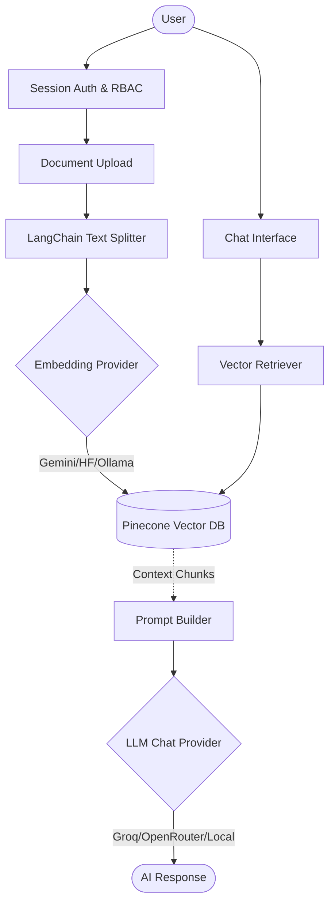

<div align="center">
  <h1>🚀 Personal RAG AI Bot Builder</h1>
  <p><b>An extensible, multi-provider Retrieval-Augmented Generation (RAG) platform.</b></p>
</div>

---

## 📌 Project Overview

**Personal AI Bot Builder** is a robust, full-stack application designed to demonstrate advanced system architecture, API abstraction, and applied AI concepts. It serves as a comprehensive knowledge-base chat platform where users can securely authenticate, define custom AI personalities, index multiple document formats, and chat with their tailored bots using a decoupled RAG pipeline.

Built as an engineering portfolio piece, this project avoids overengineered frontend frameworks in favor of a clean, highly optimized Flask/SQLite backbone. It emphasizes **modular provider abstraction**, **data security**, and **efficient embedding pipelines**.

## 🏗️ Architecture & Engineering Highlights

This platform is engineered to abstract away the underlying LLM provider, allowing seamless hot-swapping of both **Chat models** and **Embedding models** without changing the core application logic.

### 🔹 Modular Provider Strategy
- **Decoupled Pipelines**: Chat inference and vector embeddings are intentionally separated. You can use Groq for hyper-fast chat generation while leveraging Google Gemini or local Ollama instances for embeddings.
- **Supported Providers**: Groq, OpenRouter, Google Gemini, Hugging Face, and local Ollama.
- **Dynamic Routing**: Built-in fallback mechanisms ensure that if a user's API key is missing, the system gracefully degrades to environment-level `.env` keys.

### 🔹 Advanced RAG (Retrieval-Augmented Generation)
- **Multi-Format Ingestion**: Supports `.pdf`, `.docx`, and `.txt`.
- **Intelligent Chunking**: Uses LangChain's `RecursiveCharacterTextSplitter` to maintain semantic boundaries during document ingestion.
- **Vector Search**: Seamless integration with **Pinecone** for cloud-hosted vector indexing or fallback to local in-memory embeddings for offline testing.
- **Namespace Isolation**: Secures user data by querying Pinecone vectors strictly scoped to `user_{user_id}` namespaces.

### 🔹 Security & State Management
- **Role-Based Access Control (RBAC)**: Distinct `admin` and `user` roles with protected routing.
- **Secure Handling of Secrets**: API keys are conditionally rendered and securely stored, preventing frontend leakage (demonstrating mitigation of IDOR and XSS).
- **SQLite Normalization**: Fully normalized database schema managed via raw SQL to demonstrate strong database fundamentals.

---

## ⚙️ System Workflow



---

## 🚀 Quick Start (Local Deployment)

### 1. Environment Setup
Clone the repository and activate your virtual environment:
```bash
python -m venv .venv
source .venv/bin/activate
pip install -r requirements.txt
```
*(Optional)* For offline embeddings, install `sentence-transformers`:
```bash
pip install sentence-transformers
```

### 2. Configuration
Copy the template and configure your keys:
```bash
cp .env.example .env
```
Key variables to note:
- `DEFAULT_CHAT_PROVIDER` / `DEFAULT_EMBEDDING_PROVIDER`
- `GROQ_API_KEY`, `GEMINI_API_KEY`, `PINECONE_API_KEY`

### 3. Run the Platform
```bash
python app.py
```
Visit `http://127.0.0.1:5000`. The first boot automatically initializes the SQLite schema and provisions an admin account.

---

## 💡 Key Technical Features

If reviewing this project for an engineering role, consider the following technical decisions:

1. **Why Flask & Jinja over React/Next.js?**
   - Keeps the focus strictly on backend architecture, API design, and AI integration rather than UI state management. It proves a fundamental understanding of HTTP, sessions, and server-side rendering.
2. **Why separate Chat and Embedding providers?**
   - Cost optimization and performance. A developer might want free embeddings (via local Ollama or HuggingFace) while paying for high-tier logic models (like Groq's Llama 3 or GPT-4 via OpenRouter).
3. **How does the platform handle scaling?**
   - The `config.py` is written to be serverless-aware (e.g., detecting Vercel runtime environments). While the app uses SQLite for portability, the data access layer can easily be swapped for Postgres or Turso via a connection adapter.
4. **How are Vector collisions prevented?**
   - Pinecone upserts are tagged with strict `namespaces` mapped to the authenticated user's ID, ensuring the RAG pipeline only retrieves context legally accessible to the session owner.

---

<div align="center">
  <i>Built with Python, Flask, LangChain, and Pinecone.</i>
</div>
